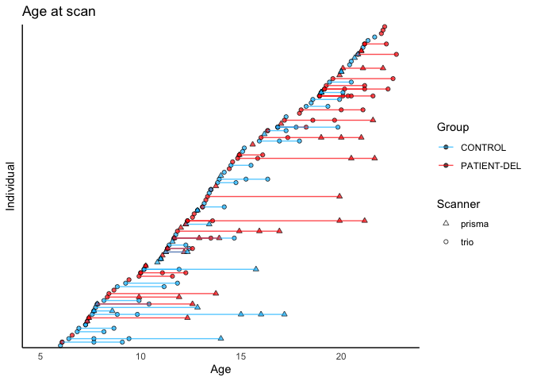
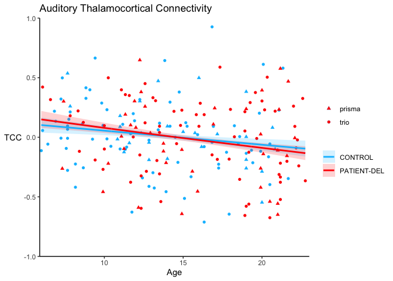
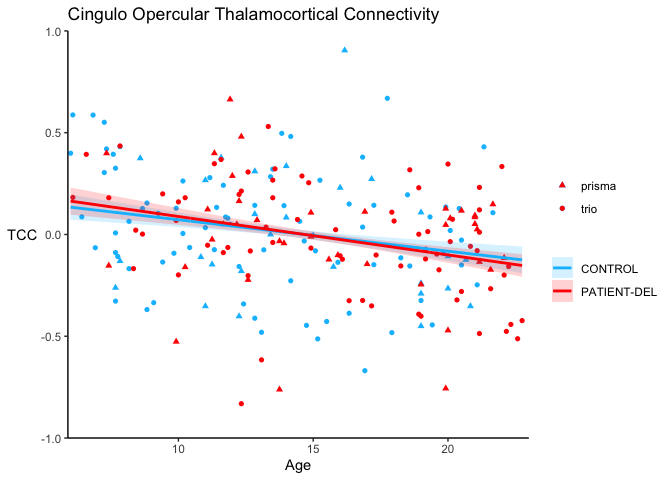
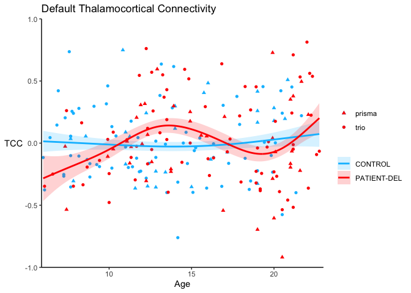
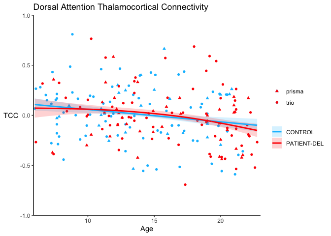
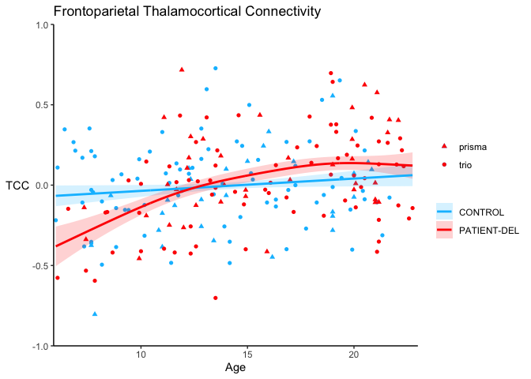
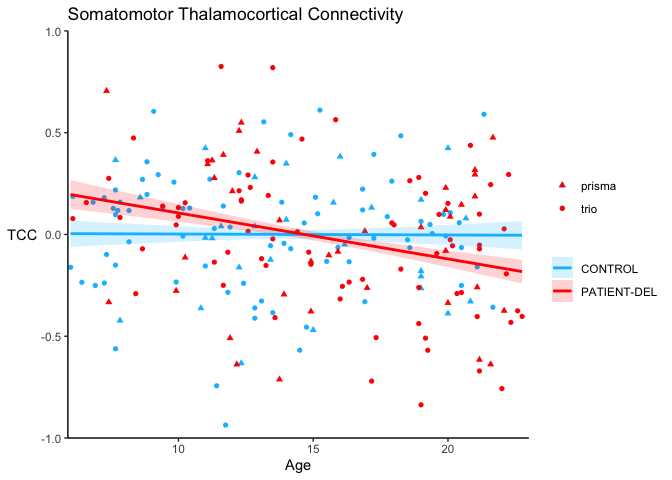
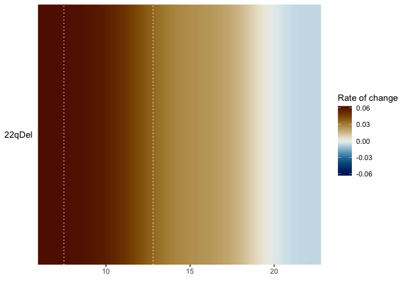
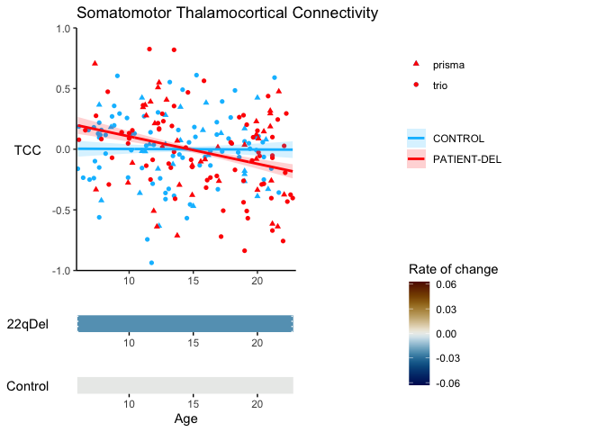

22qDel Longitudinal Thalamocortical GAMM
================
Charles Schleifer
6/23/2022

### Overview

This script uses Generalized Additive Mixed Models (GAMMs) to model
non-parametric age trajectories for thalamocortical functional network
connectivity in 22qDel patients and typical controls. A random effects
implementation of the ComBat algorithm (longCombat) is used to harmonize
data from multiple sites.

### Set up workspace

ciftiTools is an R package for analysis and plotting of CIFTI dscalar,
dlabel, and dtseries files:
<https://htmlpreview.github.io/?https://github.com/mandymejia/ciftiTools/blob/master/vignettes/ciftiTools_vignette.html>
many ciftiTools functions require connectome workbench to be downloaded
and installed locally:
<https://www.humanconnectome.org/software/get-connectome-workbench>

``` r
# clear workspace
rm(list = ls(all.names = TRUE))

# use SSHFS to mount hoffman2 server (download SSHFS for mac: https://osxfuse.github.io/)
# TODO: set hoffman2 username
uname <- "schleife"
# set local path to mount server
hoffman <- "~/Desktop/hoffman_mount"
# create directory if needed 
if(!file.exists(hoffman)){dir.create(hoffman)}
# make string to run as system command
mntcommand <- paste0("umount -f ", hoffman,"; sshfs ",uname,"@hoffman2.idre.ucla.edu:/u/project/cbearden/data ",hoffman)
# if hoffman directory is empty, use system command and sshfs to mount server, if not empty assume already mounted and skip
if(length(list.files(hoffman)) == 0){system(mntcommand)}else{print(paste(hoffman,"is not empty...skipping SSHFS step"))}

# install longCombat for first time
#install.packages("devtools")
#devtools::install_github("jcbeer/longCombat")

# list packages to load
# ciftiTools dependency rgl may need XQuartz installed in order to visualize surfaces
packages <- c("conflicted", "here", "magrittr", "mgcv", "gratia", "lme4", "lmerTest", "invgamma", "longCombat", "ciftiTools", "readxl", "dplyr", "data.table", "DescTools","tableone", "tibble", "reshape2", "viridis", "scico", "ggplot2", "gridExtra", "ggpubr","stringr")

# install packages if not yet installed
all_packages <- rownames(installed.packages())
installed_packages <- packages %in% all_packages
if (any(installed_packages == FALSE)){install.packages(packages[!installed_packages])}

# load packages
invisible(lapply(packages, library, character.only = TRUE))

# use the filter function from dplyr, not stats
conflict_prefer("filter", "dplyr")

# get path to project repo directory
project <- here()
print(paste("Project directory:", project))

# set up connectome workbench path for ciftiTools
# https://www.humanconnectome.org/software/get-connectome-workbench
# local wbpath (edit this path if workbench is installed in another location, e.g. on hoffman: /u/project/CCN/apps/hcp/current/workbench/bin_rh_linux64/)
# TODO: edit if necessary
wbpath <- "/Applications/workbench/bin_macosx64/"
ciftiTools.setOption("wb_path", wbpath)

# load rgl for ciftiTools visualization
# may require XQartz v2.8.1 to be installed locally
if(!require('rgl', quietly=TRUE)){install.packages('rgl')}
rgl::setupKnitr()
rgl::rgl.open(); rgl::rgl.close()
```

### Load CAB-NP atlas

RSN atlas of whole cortex and subcortex to use for thalamus striatum
connectivity analysis. Atlas can be downloaded here:
<https://github.com/ColeLab/ColeAnticevicNetPartition> load key for Ji
parcels/networks

``` r
ji_key <- read.table(file.path(project,"CAB-NP/CortexSubcortex_ColeAnticevic_NetPartition_wSubcorGSR_parcels_LR_LabelKey.txt"),header=T)
ji_net_keys <- ji_key[,c("NETWORKKEY","NETWORK")] %>% distinct %>% arrange(NETWORKKEY)
print(ji_net_keys)
```

    ##    NETWORKKEY              NETWORK
    ## 1           1              Visual1
    ## 2           2              Visual2
    ## 3           3          Somatomotor
    ## 4           4    Cingulo-Opercular
    ## 5           5     Dorsal-Attention
    ## 6           6             Language
    ## 7           7       Frontoparietal
    ## 8           8             Auditory
    ## 9           9              Default
    ## 10         10 Posterior-Multimodal
    ## 11         11   Ventral-Multimodal
    ## 12         12     Orbito-Affective

``` r
# read cifti with subcortical structures labeled 
xii_Ji_parcel <- read_cifti(file.path(project,"CAB-NP/CortexSubcortex_ColeAnticevic_NetPartition_wSubcorGSR_parcels_LR.dscalar.nii"), brainstructures = "all")
xii_Ji_network <- read_cifti(file.path(project,"CAB-NP/CortexSubcortex_ColeAnticevic_NetPartition_wSubcorGSR_netassignments_LR.dscalar.nii"), brainstructures = "all")

#view_xifti_volume(xii_Ji_parcel,colors="viridis",title="parcels",cex.title=1.3)
#view_xifti_volume(xii_Ji_network,colors="Paired",title="networks",cex.title=1.3)
```

### Load individual TC connectivity CSVs

Computed by 22q_multisite_networkTC_save_individual.R and saved as a CSV
with one value per network representing the z-transformed pearson
correlation between signals in the thalamic and cortical subsets of that
network

``` r
# paths to sessions directories
trio_dir <- file.path(hoffman,"22q/qunex_studyfolder/sessions")
prisma_dir <- file.path(hoffman,"22qPrisma/qunex_studyfolder/sessions")

# get list of sessions
trio_sessions <- list.files(trio_dir,pattern="Q_[0-9]")
prisma_sessions <- list.files(prisma_dir,pattern="Q_[0-9]")
# exclude Q_0390_09302019 for now due to no AP BOLD; test excluding "Q_0321_03272017","Q_0334_12012016" to ensure restingAP* vs resting* prisma are the same
#exclude_sessions <- c("Q_0390_09302019","Q_0321_03272017","Q_0334_12012016")
#exclude_sessions <- c("Q_0390_09302019","Q_0477_01052022","Q_0484_01042022","Q_0508_06232022","Q_0519_05312022","Q_0520_06012022","Q_0521_05202022","Q_0525_06072022","Q_0526_06242022","Q_0527_07112022","Q_0528_07202022","Q_0529_07202022","Q_0541_07182022","Q_0549_10182022","Q_0561_11032022","Q_0568_10252022")

# exclude only Q_0390_09302019 (missing AP BOLD)
exclude_sessions <- "Q_0390_09302019"
prisma_sessions <- prisma_sessions[! prisma_sessions %in% exclude_sessions]
all_sessions <- c(trio_sessions,prisma_sessions)

# function to read thalamocortical results and add columns for roi pair name, site, and ID 
read_tc_results <- function(sdir, fname, sesh, site){
  print(sesh)
  input <- read.csv(file.path(sdir,sesh,"images/functional",fname))
  session <- rep(sesh, times=nrow(input)) %>% as.data.frame
  site <- rep(site, times=nrow(input)) %>% as.data.frame
  new_cols <- cbind(session,site)
  colnames(new_cols) <- c("MRI_S_ID","site")
  output <- cbind(input,new_cols)
  return(output)
}

# file name to look for
tc_name_trio <- "resting_fc_network_Thal_Cortex_Atlas_s_hpss_res-mVWMWB1d_lpss_CABNP.csv"
tc_name_prisma <- "restingAP_fc_network_Thal_Cortex_Atlas_s_hpss_res-mVWMWB1d_lpss_CABNP.csv"
#tc_name_trio <- "resting_fc_network_Thal_Cortex_Atlas_s_hpss_res-mVWM1d_lpss_CABNP.csv"
#tc_name_prisma <- "restingAP_fc_network_Thal_Cortex_Atlas_s_hpss_res-mVWM1d_lpss_CABNP.csv"

# read for trio and prisma then combine
trio_tc <- lapply(trio_sessions, function(s) read_tc_results(sesh=s,site="trio",sdir=trio_dir,fname=tc_name_trio)) %>% do.call(rbind,.) %>% as.data.frame
prisma_tc <- lapply(prisma_sessions, function(s) read_tc_results(sesh=s,site="prisma",sdir=prisma_dir,fname=tc_name_prisma)) %>% do.call(rbind,.) %>% as.data.frame
all_tc <- rbind(trio_tc,prisma_tc) %>% filter(!is.na(TC_Fz))

# replaces dashes with underscores for network names
all_tc$NETWORK <- all_tc$NETWORK %>% gsub("-","_",.)

# cast to wide for combat
setDT(all_tc)
all_tc_wide <- reshape2::dcast(all_tc, MRI_S_ID + site ~ NETWORK, value.var="TC_Fz") 
```

### Load sistat data and get lists of scans to use

All sistat tables should be exported as CSVs into a single directory the
next several chunks deal with reading, cleaning and annotating the data
exported from sistat, and then age matching

``` r
# set location of directory with ucla sistat CSVs
csvdir_ucla <- file.path(project,"demographics/ucla_sistat")

# get list of files_ucla in directory
files_ucla <- list.files(csvdir_ucla)
fpaths <- lapply(files_ucla, function(file) paste(csvdir_ucla,file,sep="/"))

# clean names
fnames <- gsub(".csv","",files_ucla)
fnames <- gsub("Re22Q_","",fnames)
fnames <- gsub("Form_","",fnames)
fnames <- gsub("Qry_","",fnames)

# read all, set to na: "-9999", "-9998","." 
input_all_ucla <- lapply(fpaths, read.csv, header=T, na.strings=c(".","-9999","-9998"), strip.white=T, sep=",")
names(input_all_ucla) <- fnames
df_all_ucla <- lapply(input_all_ucla, function(x) data.frame(x))
ucla_demo <- df_all_ucla$demo_mri

# remove "FAMILY MEMBER" designation from subject identity
ucla_demo$SUBJECT_IDENTITY <- ucla_demo$SUBJECT_IDENTITY %>% sub("FAMILY MEMBER","",.) %>% sub(",","",.) %>% trimws(which="both") %>% as.factor
# change sex coding from 0/1 to F/M and set to factor
ucla_demo$SEX <- factor(ucla_demo$SEX,levels=c(0,1),labels=c("F","M"))
```

temporary: read temporary csv with several subjects not yet in sistat

``` r
# TODO: this chunk is temporary until sistat is updated 
# TODO: note: q_0526 sex was "na" in original sheet, changed to M because combat can't have NAs
# read new data
temp_demo <- read_xlsx(file.path(project,"demographics/temporary/sMRI_demo_info_forCharlie.xlsx"), col_names=TRUE,na="",trim_ws = TRUE)

# make empty demographics data frame to add new data to
demo_add <- ucla_demo[1:nrow(temp_demo),]
demo_add[,] <- NA
demo_add$SUBJECTID <- temp_demo$`Subject ID`
demo_add$SUBJECT_IDENTITY <- temp_demo$Diagnosis
demo_add$MRI_S_ID <- temp_demo$`MRI ID`
demo_add$SEX <- as.factor(temp_demo$Sex)
demo_add$AGE <- temp_demo$Age
demo_add$AGEMONTH <- temp_demo$Age*12
demo_add$CONVERTEDVISITNUM <- 2

# append to ucla demo
ucla_demo <- rbind(ucla_demo,demo_add)
```

continue regular steps

``` r
# subset demo_mri for used scans
ucla_demo <- filter(ucla_demo, MRI_S_ID %in% all_sessions)

# manually fix missing sex for Q_0381_09102019
# TODO: fix in sistat and re-export
ucla_demo[which(ucla_demo$MRI_S_ID == "Q_0381_09102019"),"SEX"] <- "F"

# set race=NA to 7 (unknown)
ucla_demo$RACE[is.na(ucla_demo$RACE)] <- 7
# set race as factor 1=American Indian/Alaska Native; 2=Asian; 3=Native Hawaiian/Pacific Islander; 4=Black or African American; 5=White; 6=Multiple; 7=Unknown
ucla_demo$RACE <- factor(ucla_demo$RACE,levels=c(1:7),labels=c("1_Native_American","2_Asian","3_Pacific_Island","4_Black","5_White","6_Multiple","7_Unknown"))
# ethnicity as factor with 0=N 1=Y
ucla_demo$HISPANIC[is.na(ucla_demo$HISPANIC)] <- "Unknown"
ucla_demo$HISPANIC <- factor(ucla_demo$HISPANIC,levels=c(0,1,"Unknown"),labels=c("N","Y","Unknown"))
# get more accurate age with AGEMONTH/12
ucla_demo$AGE <- as.numeric(ucla_demo$AGEMONTH)/12 

# subset to under max age limit (22 years old)
ucla_demo_agelim <- filter(ucla_demo, ucla_demo$AGE <= 23)

# subset to hcs del
ucla_demo_agelim_group <- filter(ucla_demo_agelim, SUBJECT_IDENTITY=="CONTROL" | SUBJECT_IDENTITY =="PATIENT-DEL")

# remove unused factor levels
ucla_demo_agelim_group %<>% droplevels

# function to add column to code timepoints relative to sample used (i.e. if visit 1 and 1.12 missing, then 1.24 is baseline)
# trio/prisma coded as T/P-visit_n where T-1 would be the subject's first trio scan and P-1 the first prisma, P-2 the second...
# function should be applied to the indicies of rows (r) in a subset of demo_mri
gettp <- function(r, df){
  sub <- df$SUBJECTID[[r]]
  visit <- df$CONVERTEDVISITNUM[[r]]
  all_visits <- df$CONVERTEDVISITNUM[which(df$SUBJECTID == sub)] %>% sort
  n_visits <- length(all_visits)
  nt_visits <-length(which(all_visits < 2))
  np_visits <- length(which(all_visits >= 2))
  visit_index <- which(all_visits == visit)
  if (visit < 2){
    label=paste("T-",visit_index,sep="")
  }else if (visit >= 2){
    p_visits <- all_visits[which(all_visits >= 2)] %>% sort
    p_visit_index <- which(p_visits == visit)
    label=paste("P-",p_visit_index,sep="")
  }
  return(data.frame(SUBJECTID=sub,CONVERTEDVISITNUM=visit,converted_timepoint=label,n_timepoints=n_visits,n_trio=nt_visits,n_prisma=np_visits,visit_index=visit_index))
}

# get timepoints
#timepoints <- sapply(1:nrow(ucla_demo_agelim_group),function(r) gettp(r,ucla_demo_agelim_group)) %>% t %>% as.data.frame
timepoints <- lapply(1:nrow(ucla_demo_agelim_group),function(r) gettp(r,ucla_demo_agelim_group)) %>% do.call(rbind,.) %>% as.data.frame

#colnames(timepoints) <- c("SUBJECTID","CONVERTEDVISITNUM","converted_timepoint","n_timepoints","n_trio","n_prisma","visit_index")
#ucla_demo_hcs_del <- cbind(ucla_demo_agelim_group,timepoints[,3:7])
ucla_demo_hcs_del <- merge(x=ucla_demo_agelim_group,y=timepoints, by=c("SUBJECTID","CONVERTEDVISITNUM"))

ucla_demo_hcs_del$visit_index %<>% as.factor
```

All timepoints, pre-matching demographics summary

``` r
demo_summary <- CreateTableOne(data=ucla_demo_hcs_del,vars=c("AGE","SEX"),strata="SUBJECT_IDENTITY",addOverall=F)
print(demo_summary, showAllLevels=T)
```

    ##                  Stratified by SUBJECT_IDENTITY
    ##                   level CONTROL       PATIENT-DEL   p      test
    ##   n                       108           112                    
    ##   AGE (mean (SD))       13.54 (4.44)  15.78 (4.59)  <0.001     
    ##   SEX (%)         F        52 (48.1)     70 (62.5)   0.045     
    ##                   M        56 (51.9)     42 (37.5)

Baseline pre-matching summary

``` r
demo_summary_bl <- CreateTableOne(data=filter(ucla_demo_hcs_del, ucla_demo_hcs_del$visit_index == 1),vars=c("AGE","SEX"),strata="SUBJECT_IDENTITY",addOverall=F)
print(demo_summary_bl)
```

    ##                  Stratified by SUBJECT_IDENTITY
    ##                   CONTROL       PATIENT-DEL   p      test
    ##   n                  69            65                    
    ##   AGE (mean (SD)) 13.44 (4.76)  14.39 (4.56)   0.242     
    ##   SEX = M (%)        35 (50.7)     24 (36.9)   0.151

Age waterfall plot

``` r
ucla_demo_waterfall <- ucla_demo_hcs_del
ucla_demo_waterfall$Scanner <- gsub("-[0-9]","",ucla_demo_waterfall$converted_timepoint)
ucla_demo_waterfall$Scanner %<>% gsub("T","trio",.)
ucla_demo_waterfall$Scanner %<>% gsub("P","prisma",.)
ucla_demo_waterfall$Group <- ucla_demo_waterfall$SUBJECT_IDENTITY
# get age at timepoint 1 for every row
ucla_demo_waterfall$age1 <- lapply(ucla_demo_waterfall$SUBJECTID, function(i) min(filter(ucla_demo_waterfall, SUBJECTID==i)$AGEMONTH)) %>% do.call(rbind,.)

#waterfall <- ggplot(ucla_demo_waterfall, aes(x=(AGEMONTH/12), y=reorder(SUBJECTID, AGEMONTH),color=Group, fill=Group)) +
waterfall <- ggplot(ucla_demo_waterfall, aes(x=(AGEMONTH/12), y=as.factor(age1), color=Group, fill=Group)) +
  geom_point(aes(shape=Scanner), color="black",alpha=0.7) + 
  scale_shape_manual(values = c(24,21)) + 
  theme_classic() + 
  #theme(text=element_text(family="Arial"))+
  theme(axis.text.y=element_blank(), axis.ticks.x=element_blank(),axis.ticks.y=element_blank()) + 
  geom_line(aes(group=SUBJECTID,color=SUBJECT_IDENTITY),alpha=0.7) +
  scale_fill_manual(values = c("CONTROL" = "deepskyblue", "PATIENT-DEL" = "red")) +
  scale_color_manual(values = c("CONTROL" = "deepskyblue", "PATIENT-DEL" = "red")) +
  ylab("Individual") +
  xlab("Age") +
  xlim(5,23)+
  ggtitle("Age at scan")+
  coord_cartesian(clip = "off")

waterfall
```

<!-- -->

``` r
#ggsave(plot=waterfall, filename=file.path(project,"figures/demographics/waterfall_age.svg"), width=6, height=6, device = "svg")
#ggsave(plot=waterfall, filename=file.path(project,"figures/demographics/waterfall_age.png"), width=6, height=6, device = "png")
#ggsave(plot=waterfall, filename=file.path(project,"figures/demographics/waterfall_age.pdf"), width=6, height=6, device = "pdf")
```

Get motion data for all sessions by reading movement scrubbing files on
hoffman

``` r
# function to get mapping between boldn and run name from session_hcp.txt
get_boldn_names <- function(sesh,sessions_dir){
  hcptxt <- read.table(file.path(sessions_dir,sesh,"session_hcp.txt"),sep=":",comment.char="#",fill=T,strip.white=T,col.names=c(1:4)) %>% as.data.frame()
  hcpbolds <- hcptxt %>% filter(grepl("bold[0-9]",X2))
  df_out <- cbind(rep(sesh,times=nrow(hcpbolds)),hcpbolds$X2,hcpbolds$X3)
  colnames(df_out) <- c("sesh","bold_n","bold_name")
  return(df_out)
}

# function to get %udvarsme from images/functional/movement/boldn.scrub
get_percent_udvarsme <- function(sesh,sessions_dir,bold_name_use){
  mov_dir <- file.path(sessions_dir,sesh,"images/functional/movement")
  sesh_bolds <- get_boldn_names(sesh=sesh,sessions_dir=sessions_dir) %>% as.data.frame %>% filter(bold_name == bold_name_use)
  if(nrow(sesh_bolds) > 0){
    boldns_use <- sesh_bolds$bold_n %>% as.vector
    for(i in 1:length(boldns_use)){
      boldn <- boldns_use[i] %>% as.character
      boldn_path <- file.path(mov_dir,paste(boldn,".scrub",sep=""))
      mov_scrub <- read.table(boldn_path, header=T)
      percent_udvarsme <- (sum(mov_scrub$udvarsme == 1)/length(mov_scrub$udvarsme)*100) %>% as.numeric %>% signif(3)
      percent_use <- (sum(mov_scrub$udvarsme == 0)/length(mov_scrub$udvarsme)*100) %>% as.numeric %>% signif(3)
      df_out <- cbind(sesh,boldn,bold_name_use,percent_udvarsme,percent_use)
      colnames(df_out) <- c("sesh","bold_n","bold_name","percent_udvarsme","percent_use")
      return(df_out)
    }
  }
}

# get trio movement
percent_udvarsme_trio <- lapply(trio_sessions,function(s) get_percent_udvarsme(sesh=s,sessions_dir=trio_dir,bold_name_use="resting")) %>% do.call(rbind,.) %>% as.data.frame
percent_udvarsme_trio$percent_udvarsme <- as.numeric(percent_udvarsme_trio$percent_udvarsme)
percent_udvarsme_trio$percent_use <- as.numeric(percent_udvarsme_trio$percent_use)

# get prisma movement
percent_udvarsme_prisma <- lapply(prisma_sessions,function(s) get_percent_udvarsme(sesh=s,sessions_dir=prisma_dir,bold_name_use="restingAP")) %>% do.call(rbind,.) %>% as.data.frame
percent_udvarsme_prisma$percent_udvarsme <- as.numeric(percent_udvarsme_prisma$percent_udvarsme)
percent_udvarsme_prisma$percent_use <- as.numeric(percent_udvarsme_prisma$percent_use)

# combine
percent_udvarsme_all <- rbind(percent_udvarsme_trio,percent_udvarsme_prisma)
```

Merge TC with demo_mri

``` r
demo_mri_tc <- merge(x=ucla_demo_hcs_del, y=all_tc_wide, by="MRI_S_ID")
demo_mri_tc_hcs_del <- demo_mri_tc %>% filter(SUBJECT_IDENTITY=="CONTROL" | SUBJECT_IDENTITY =="PATIENT-DEL")

# change class to factor
demo_mri_tc_hcs_del$SUBJECT_IDENTITY <- factor(demo_mri_tc_hcs_del$SUBJECT_IDENTITY)
demo_mri_tc_hcs_del$SUBJECTID <- factor(demo_mri_tc_hcs_del$SUBJECTID)
demo_mri_tc_hcs_del$site <- factor(demo_mri_tc_hcs_del$site)
demo_mri_tc_hcs_del$MRI_S_ID <- factor(demo_mri_tc_hcs_del$MRI_S_ID)

# list of TC network names
tc_names <- names(all_tc_wide)[which(!(names(all_tc_wide) %in% c("MRI_S_ID", "site")))]
```

### Harmonize sites

longCombat for thalamocortical connectivity

``` r
# set up longCombat variables
# formula should match fixed effects in your subsequent analysis
# subject id coded as random effect by (1|subject id variable)
demovars <- c("MRI_S_ID","SUBJECTID","site","SUBJECT_IDENTITY","AGE","SEX","visit_index")
features <- tc_names
idvar <- 'MRI_S_ID'
batchvar <- 'site'
timevar <- 'visit_index'
formula <- 'SUBJECT_IDENTITY + AGE + SEX'
ranef <- '(1|SUBJECTID)'

# make data frame with columns for each variable in the model
# one column for each variable in your formula as well as one column for each neuroimaging feature
# input df should not have any unused columns or package will error
# one row per unique scan
combat_input_tc_hcs_del <- demo_mri_tc_hcs_del[,c(demovars,features)]

# run longCombat
tc_net_combat <- longCombat(data=combat_input_tc_hcs_del, idvar=idvar, timevar=timevar, batchvar=batchvar, features=features, formula=formula, ranef=ranef)

# get the harmonized data
tc_net_combat_data <- tc_net_combat$data_combat

# merge combat back with original
demo_mri_tc_hcs_del_combat <- merge(x=demo_mri_tc_hcs_del, y=tc_net_combat_data, by=c("MRI_S_ID","visit_index","site"))
```

### GAMMs

function to get smoothed estimates with upper and lower SE bounds

``` r
smooth_estimates_se <- function(gamm,smooth,n){
  out <- smooth_estimates(gamm,smooth,n=n, partial_match = T)
  out$selo <- out$est - out$se
  out$sehi <- out$est + out$se
  return(out)
}

# get smooth estimates shifted by GAMM intercept to allow plotting over original data
smooth_estimates_se_b0 <- function(gamm,smooth,n){
  out <- smooth_estimates(gamm,smooth,n=n, partial_match = T)
  out$est <- out$est + gamm$coefficients["(Intercept)"]
  out$selo <- out$est - out$se
  out$sehi <- out$est + out$se
  return(out)
}
```

GAMM for harmonized TC

``` r
# combat feature names
tc_names_combat <- paste(tc_names,".combat",sep="")

# winsorize and replace original data 
#tc_winsorized <- do.call(cbind, lapply(tc_names_combat, function(name) data.frame(Winsorize(demo_mri_tc_hcs_del_combat[,name], probs=c(0.05,0.95)))))
#colnames(tc_winsorized) <- tc_names_combat
#demo_mri_tc_hcs_del_combat[,tc_names_combat] <- tc_winsorized

# generalized additive mixed model
gamm_tc_all_combat <- lapply(tc_names_combat,function(name) gam(reformulate(c("s(AGE,by=SUBJECT_IDENTITY)","SUBJECT_IDENTITY","SEX","site","s(SUBJECTID, bs=\"re\")"), response=name),selection=TRUE,method="REML",data=demo_mri_tc_hcs_del_combat))
names(gamm_tc_all_combat) <- tc_names_combat

# smooth estimate
smooth_tc_all_combat <- lapply(gamm_tc_all_combat, function(g) smooth_estimates_se(gamm=g, smooth="s(AGE)", n=(40*12)))
names(smooth_tc_all_combat) <- tc_names_combat

smooth_tc_all_combat_b0 <- lapply(gamm_tc_all_combat, function(g) smooth_estimates_se_b0(gamm=g, smooth="s(AGE)", n=(40*12)))
names(smooth_tc_all_combat_b0) <- tc_names_combat
```

p-vals for significant age effect by group

``` r
#print("Somatomotor.combat")
#summary(gamm_tc_all_combat[[which(tc_names_combat == "Somatomotor.combat")]], freq=T)$s.table
#print("Frontoparietal.combat")
#summary(gamm_tc_all_combat[[which(tc_names_combat == "Frontoparietal.combat")]], freq=T)$s.table

# 
stables <- lapply(gamm_tc_all_combat,function(g) summary(g, freq=T)$s.table)

del_age_pvals <- lapply(stables, function(s)s["s(AGE):SUBJECT_IDENTITYPATIENT-DEL",c("F","p-value")]) %>% do.call(rbind,.) %>% data.frame %>% rename("age_p_val"="p.value")
del_age_pvals$Network <- rownames(del_age_pvals)
del_age_pvals$SUBJECT_IDENTITY <- "PATIENT-DEL"

hcs_age_pvals <- lapply(stables, function(s)s["s(AGE):SUBJECT_IDENTITYCONTROL",c("F","p-value")]) %>% do.call(rbind,.) %>% data.frame  %>% rename("age_p_val"="p.value")
hcs_age_pvals$Network <- rownames(hcs_age_pvals)
hcs_age_pvals$SUBJECT_IDENTITY <- "CONTROL"

# correct for multiple comparisons (one test for age effects per group per network)
all_age_pvals <- rbind(del_age_pvals,hcs_age_pvals)
all_age_pvals$age_p_val_fdr <- all_age_pvals$age_p_val %>% p.adjust(., method="fdr")
all_age_pvals
```

Make table for export

``` r
out_age_pvals <- all_age_pvals[,c("SUBJECT_IDENTITY","Network","F","age_p_val","age_p_val_fdr")]
rownames(out_age_pvals) <- NULL
out_age_pvals <- rename(out_age_pvals, "p"="age_p_val","FDR_q"="age_p_val_fdr", "Group"="SUBJECT_IDENTITY")
out_age_pvals$Group <- out_age_pvals$Group %>% gsub("CONTROL","TD",.) %>% gsub("PATIENT-DEL","22qDel",.)
out_age_pvals$Network <- gsub(".combat","",out_age_pvals$Network)
out_age_pvals$F %<>% round(., digits=2) %>% sprintf("%.4f",.)
out_age_pvals$p %<>% signif(., digits=2) %>% sprintf("%.3f",.)
out_age_pvals$FDR_q %<>% signif(., digits=3) %>% sprintf("%.4f",.)
out_age_pvals
```

    ##     Group              Network      F     p  FDR_q
    ## 1  22qDel             Auditory 5.4700 0.020 0.0915
    ## 2  22qDel    Cingulo_Opercular 7.5300 0.007 0.0399
    ## 3  22qDel              Default 2.5300 0.031 0.0998
    ## 4  22qDel     Dorsal_Attention 2.4300 0.066 0.1690
    ## 5  22qDel       Frontoparietal 5.8900 0.002 0.0177
    ## 6  22qDel Posterior_Multimodal 0.0100 0.930 0.9520
    ## 7  22qDel          Somatomotor 9.8400 0.002 0.0177
    ## 8  22qDel              Visual1 1.7900 0.180 0.3290
    ## 9  22qDel              Visual2 1.3900 0.240 0.3910
    ## 10     TD             Auditory 2.5700 0.110 0.2200
    ## 11     TD    Cingulo_Opercular 4.6000 0.033 0.0998
    ## 12     TD              Default 0.4300 0.680 0.7630
    ## 13     TD     Dorsal_Attention 3.0400 0.083 0.1870
    ## 14     TD       Frontoparietal 1.0300 0.310 0.4320
    ## 15     TD Posterior_Multimodal 0.2800 0.600 0.7160
    ## 16     TD          Somatomotor 0.0000 0.950 0.9520
    ## 17     TD              Visual1 1.1900 0.310 0.4320
    ## 18     TD              Visual2 0.6300 0.430 0.5520

``` r
# for export, skip to derivative section to merge with significant age ranges
```

Plot all TC smooths

``` r
# function to plot gamm and scatter
#plot_gamm_points_tc_combat <- function(name,xlab="", ylab="",ylim=c(-1,1.1),xlim=c(5.9,23)){
#  ggplot(data = smooth_tc_all_combat_b0[[name]],  aes_string(x="AGE", y="est"))+
#  geom_ribbon(aes_string(x = "AGE", ymin = "selo",ymax = "sehi", fill = "SUBJECT_IDENTITY"),alpha = .18, linetype = 0)+
#  scale_x_continuous(limits=xlim,expand=c(0,0))+
#  scale_y_continuous(limits=ylim,expand=c(0,0))+
#  geom_line(aes_string(x = "AGE", y = "est", color = "SUBJECT_IDENTITY"),size = 1)+theme_bw()+
#  theme_classic() + 
#  theme(legend.title = element_blank())+
#  theme(axis.title.y = element_text(angle = 0,vjust=0.5))+
#  ylab(ylab)+
#  xlab(xlab)+
#  ggtitle(paste(gsub("_"," ",gsub(".combat","",name)),"Thalamocortical Connectivity"))+
#  scale_fill_manual(values = c("CONTROL" = "deepskyblue", "PATIENT-DEL" = "red")) +
#  scale_color_manual(values = c("CONTROL" = "deepskyblue", "PATIENT-DEL" = "red")) +
#  geom_point(data=demo_mri_tc_hcs_del_combat, aes_string(x="AGE", y=name, color="SUBJECT_IDENTITY", fill="SUBJECT_IDENTITY",shape="site")) +
#  scale_shape_manual(values = c(17, 16)) 
#}
#
#lapply(tc_names_combat,function(x) plot_gamm_points_tc_combat(x,xlab="Age",ylab="TCC"))
```

Plot two favorites

``` r
#plot_gamm_points_tc_combat_ylab <- function(name){
#  ggplot(data = smooth_tc_all_combat_b0[[name]],  aes_string(x="AGE", y="est"))+
#  geom_ribbon(aes_string(x = "AGE", ymin = "selo",ymax = "sehi", fill = "SUBJECT_IDENTITY"),alpha = .18, linetype = 0)+
#  geom_line(aes_string(x = "AGE", y = "est", color = "SUBJECT_IDENTITY"),size = 1)+theme_bw()+
#  theme_classic() + 
#  theme(legend.title = element_blank())+
#  ylab("Thalamocortical connectivity (mean Fz)")+
#  ylim(-1,1)+
#  ggtitle(sub(".combat","",name))+
#  theme(plot.title = element_text(vjust=-6, hjust=0.1))+
#  scale_fill_manual(values = c("CONTROL" = "deepskyblue", "PATIENT-DEL" = "red")) +
#  scale_color_manual(values = c("CONTROL" = "deepskyblue", "PATIENT-DEL" = "red")) +
#  geom_point(data=demo_mri_tc_hcs_del_combat, aes_string(x="AGE", y=name, color="SUBJECT_IDENTITY", fill="SUBJECT_IDENTITY",shape="site")) +
#  scale_shape_manual(values = c(17, 16)) 
#}
#
#plot_gamm_points_tc_combat_noylab <- function(name){
#  ggplot(data = smooth_tc_all_combat_b0[[name]],  aes_string(x="AGE", y="est"))+
#  geom_ribbon(aes_string(x = "AGE", ymin = "selo",ymax = "sehi", fill = "SUBJECT_IDENTITY"),alpha = .18, linetype = 0)+
#  geom_line(aes_string(x = "AGE", y = "est", color = "SUBJECT_IDENTITY"),size = 1)+theme_bw()+
#  theme_classic() + 
#  theme(legend.title = element_blank(),axis.title.y=element_blank())+
#  theme(legend.title = element_blank(),axis.text.y=element_blank(),axis.title.y=element_blank())+
#  ylim(-1,1)+
#  ggtitle(sub(".combat","",name))+
#  theme(plot.title = element_text(vjust=-6, hjust=0.1))+
#  scale_fill_manual(values = c("CONTROL" = "deepskyblue", "PATIENT-DEL" = "red")) +
#  scale_color_manual(values = c("CONTROL" = "deepskyblue", "PATIENT-DEL" = "red")) +
#  geom_point(data=demo_mri_tc_hcs_del_combat, aes_string(x="AGE", y=name, color="SUBJECT_IDENTITY", fill="SUBJECT_IDENTITY",shape="site")) +
#  scale_shape_manual(values = c(17, 16)) 
#}
#p1 <- plot_gamm_points_tc_combat_ylab("Frontoparietal.combat")
#p2 <- plot_gamm_points_tc_combat_noylab("Somatomotor.combat")

#ggarange not displaying in rmd but works if pasted into console
#pf <- ggarrange(p1,p2,nrow=1, common.legend=T,legend="right")
#ggsave("~/Dropbox/PhD/bearden_lab/22q/analyses/longitudinal_gamm/tc_plots_som_fpn_dmn.png", device="png",width=13 ,height=4, units="in", dpi = 100, plot=pf)
```

Plot with individual subject longitudinal lines

``` r
#plot_gamm_pointslines_tc_combat <- function(name,xlab="", ylab="",ylim=c(-1,1.1),xlim=c(5.9,22)){
#  ggplot(data = smooth_tc_all_combat_b0[[name]],  aes_string(x="AGE", y="est"))+
#  geom_ribbon(aes_string(x = "AGE", ymin = "selo",ymax = "sehi", fill = "SUBJECT_IDENTITY"),alpha = .18, linetype = 0)+
#  scale_x_continuous(limits=xlim,expand=c(0,0))+
#  scale_y_continuous(limits=ylim,expand=c(0,0))+
#  geom_line(aes_string(x = "AGE", y = "est", color = "SUBJECT_IDENTITY"),size = 1)+theme_bw()+
#  theme_classic() + 
#  theme(legend.title = element_blank())+
#  theme(axis.title.y = element_text(angle = 0,vjust=0.5))+
#  ylab(ylab)+
#  xlab(xlab)+
#  ggtitle(paste(name,"Thalamocortical GAMM"))+
#  scale_fill_manual(values = c("CONTROL" = "deepskyblue", "PATIENT-DEL" = "red")) +
#  scale_color_manual(values = c("CONTROL" = "deepskyblue", "PATIENT-DEL" = "red")) +
#  geom_point(data=demo_mri_tc_hcs_del_combat, aes_string(x="AGE", y=name, color="SUBJECT_IDENTITY", fill="SUBJECT_IDENTITY",shape="site")) +
#  scale_shape_manual(values = c(17, 16))+
#  geom_line(data=demo_mri_tc_hcs_del_combat, aes_string(group="SUBJECTID",color="SUBJECT_IDENTITY",x="AGE", y=name), alpha=0.5)
#}
#
#plot_lines <- plot_gamm_pointslines_tc_combat("Frontoparietal.combat",xlab="Age",ylab="TCC")
#plot_lines
#lapply(tc_names_combat,function(x) plot_gamm_points_tc_combat(x,xlab="Age",ylab="TCC"))
```

Plot all TC smooths with partial residuals

``` r
plot_gamm_resid_tc <- function(name,xlab="", ylab="",ylim=c(-1,1),xlim=c(5.9,23)){
  resid <- add_partial_residuals(data=demo_mri_tc_hcs_del_combat,model=gamm_tc_all_combat[[name]])
  resid_del <- filter(resid, SUBJECT_IDENTITY=="PATIENT-DEL")
  resid_del$yvar <- resid_del$`s(AGE):SUBJECT_IDENTITYPATIENT-DEL`
  resid_hcs <- filter(resid, SUBJECT_IDENTITY=="CONTROL")
  resid_hcs$yvar <- resid_hcs$`s(AGE):SUBJECT_IDENTITYCONTROL`
  ggplot()+
    geom_point(data=resid_hcs, aes(x=AGE, y=yvar, shape=site), color="deepskyblue") +
    geom_point(data=resid_del, aes(x=AGE, y=yvar, shape=site), color="red") +
    scale_shape_manual(values = c(17, 16))+
    geom_ribbon(data = smooth_tc_all_combat[[name]],aes(x = AGE, ymin = selo,ymax = sehi, fill = SUBJECT_IDENTITY),alpha = .18, linetype = 0)+
    geom_line(data = smooth_tc_all_combat[[name]],aes(x = AGE, y = est, color = SUBJECT_IDENTITY),size = 1)+theme_bw()+
    scale_fill_manual(values = c("CONTROL" = "deepskyblue", "PATIENT-DEL" = "red")) +
    scale_color_manual(values = c("CONTROL" = "deepskyblue", "PATIENT-DEL" = "red")) +
    scale_x_continuous(limits=xlim,expand=c(0,0))+
    scale_y_continuous(limits=ylim,expand=c(0,0))+
    theme_classic() + 
    theme(legend.title = element_blank())+
    theme(axis.title.y = element_text(angle = 0,vjust=0.5))+
    ylab(ylab)+
    xlab(xlab)+
    ggtitle(paste(gsub("_"," ",gsub(".combat","",name)),"Thalamocortical Connectivity"))
}

#plot_gamm_resid_tc(name="Frontoparietal.combat",xlab="Age",ylab="TCC")
#plot_gamm_resid_tc(name="Somatomotor.combat",xlab="Age",ylab="TCC")
lapply(tc_names_combat,function(x) plot_gamm_resid_tc(name=x,xlab="Age",ylab="TCC"))
```

    ## [[1]]

<!-- -->

    ## 
    ## [[2]]

<!-- -->

    ## 
    ## [[3]]

<!-- -->

    ## 
    ## [[4]]

<!-- -->

    ## 
    ## [[5]]

<!-- -->

    ## 
    ## [[6]]

<!-- -->

    ## 
    ## [[7]]

<!-- -->

    ## 
    ## [[8]]

<!-- -->

    ## 
    ## [[9]]

<!-- -->

Test derivative of curves

``` r
# get list of derivative objects
dervs_del <- lapply(gamm_tc_all_combat, function(g) derivatives(object=g, term="s(AGE):SUBJECT_IDENTITYPATIENT-DEL",n_sim=100000))
dervs_hcs <- lapply(gamm_tc_all_combat, function(g) derivatives(object=g, term="s(AGE):SUBJECT_IDENTITYCONTROL",n_sim=100000))

# function to take derivative output that includes an age smooth output age range where CI doesn't include zero
# adapted from https://github.com/pittnerdlab/22q11_longitudinal_cortical_sMRI/blob/main/01a_age_effects.Rmd
get_sig_derv_ages <- function(gam, smooth){
  # get derivative of specified smooth from gam
  derv <- derivatives(object=gam, term=smooth,n_sim=100000)
  # get points where confidence interval doesn't include zero
  sig <- sign(derv$lower) == sign(derv$upper)
  # get list of ages  
  agelist <- derv$data[sig]
  ## create age range from list of ages
  # set age gap (years) between significant ages to be considered new range
  sigjump_brain<-0.23
  j=1
  ranges=""
  if(length(agelist)>0) {
    ranges<-round(agelist[[j]],digits=1)
  }
  while (j < length(agelist)) {
    j<-j+1
    diff<-agelist[[j]]-agelist[[j-1]]
    if (diff > sigjump_brain) {
      ranges<-paste0(ranges,"-",round(agelist[[j-1]],digits=1),"|",round(agelist[[j]],digits=1))
    }
    if(j==length(agelist)){
      ranges<-paste0(ranges,"-",round(agelist[[j]],digits=1))
    }
  }
  return(ranges)
}

#get_sig_derv_ages(gam=gamm_tc_all_combat[["Frontoparietal.combat"]], smooth="s(AGE):SUBJECT_IDENTITYPATIENT-DEL")
sig_ages_del <- lapply(gamm_tc_all_combat, function(g) get_sig_derv_ages(gam=g, smooth="s(AGE):SUBJECT_IDENTITYPATIENT-DEL"))
sig_ages_hcs <- lapply(gamm_tc_all_combat, function(g) get_sig_derv_ages(gam=g, smooth="s(AGE):SUBJECT_IDENTITYCONTROL"))

# get max derivative value to set plot limits
maxderv_fs <- lapply(dervs_del[c("Somatomotor.combat","Frontoparietal.combat")], function(d) d[,"derivative"]) %>% do.call(rbind,.) %>% abs %>% max %>% round(digits=3)
maxderv_all <- lapply(dervs_del[tc_names_combat], function(d) d[,"derivative"]) %>% do.call(rbind,.) %>% abs %>% max %>% round(digits=3)

# function to plot derivatives
plot_age_dervs <- function(derv,ylab="", xlab="",legend_position="right",ageranges="",maxderv=maxderv_fs){
  # get derivative of specified smooth from gam
  #derv <- derivatives(object=gam, term=smooth,n_sim=100000)
  # get ages to mark start and end of sig age ranges on derivative plots
  age_vlines <- ageranges %>% str_split(.,"\\|") %>% unlist %>% str_split(.,"-") %>% unlist %>% as.numeric
  pl <- ggplot(data=derv, aes(x=data, y=1, fill=derivative))+
      geom_raster(interpolate=FALSE)+
      scale_x_continuous(limits=c(5.9,23),expand = c(0,0))+
      scale_y_continuous(limits=c(0.5,1.5),expand = c(0,0))+
      #scale_fill_viridis("rate of change", option="inferno")+
      #scale_fill_gradient2(high="#dd4124",low="#00496f", mid="white", limits = c(min(derv$derivative),max(derv$derivative)))+ 
      scale_fill_scico(palette="vik",direction=1,limits=c(-maxderv,maxderv),name="Rate of change")+
      #scale_fill_scico(palette="roma",direction=-1,limits=c(-0.65,0.65),name="Rate of change")+
      #scale_fill_scico(palette="vik",direction=1,limits=c(-maxderv,maxderv),name="Rate of change")+
      geom_vline(xintercept=age_vlines, color="white", linetype="dotted")+
      theme_minimal()+
      xlab(xlab)+
      ylab(ylab)+
      theme(axis.ticks.x = element_line(color="black"))+
      theme(axis.ticks.y=element_blank())+
      theme(axis.text.y=element_blank())+
      theme(axis.title.y = element_text(angle = 0,vjust=0.5))+
      theme(legend.position=legend_position)+
      #theme(axis.title.y=element_blank())+
      theme(panel.grid=element_blank())
  return(pl)
}

plot_derv_fpn_del <- plot_age_dervs(dervs_del[["Frontoparietal.combat"]], ylab="22qDel",ageranges=sig_ages_del[["Frontoparietal.combat"]])
plot_derv_fpn_del
```

<!-- -->

``` r
plot_derv_fpn_hcs <- plot_age_dervs(dervs_hcs[["Frontoparietal.combat"]], ylab="Control",xlab="Age",ageranges=sig_ages_hcs[["Frontoparietal.combat"]])
plot_derv_som_del <- plot_age_dervs(dervs_del[["Somatomotor.combat"]], ylab="22qDel",ageranges=sig_ages_del[["Somatomotor.combat"]])
plot_derv_som_hcs <- plot_age_dervs(dervs_hcs[["Somatomotor.combat"]], ylab="Control",xlab="Age",ageranges=sig_ages_hcs[["Somatomotor.combat"]])

# get frontoparietal GAMM plot
plot_gamms_fpn <- plot_gamm_resid_tc(name="Frontoparietal.combat", ylab="TCC")

legend_gam <- get_legend(plot_gamms_fpn)
legend_derv <- get_legend(plot_derv_fpn_hcs)
legend_combo <- ggarrange(legend_gam,legend_derv,nrow=2)

plot_gamms_dervs_fpn <- ggarrange(plot_gamms_fpn, plot_derv_fpn_del,plot_derv_fpn_hcs,nrow=3,legend="none",common.legend=T,align="v",heights=c(5,1,1))
plot_gamms_dervs_fpn_legend <- ggarrange(plot_gamms_dervs_fpn,legend_combo,nrow=1)
plot_gamms_dervs_fpn_legend
```

<!-- -->

``` r
# save frontoparietal GAMM plots with settings for printing for 45x45in poster
#ggsave(plot=plot_gamms_dervs_fpn_legend, filename=file.path(project,"figures/fpn_som_age_curves/fpn_gamm_raw.pdf"),device="pdf",bg="transparent", width=10, height=5.5, dpi=1000, units="in")


# get somatomotor GAMM plot
plot_gamms_som <- plot_gamm_resid_tc(name="Somatomotor.combat", ylab="TCC")

#legend_gam <- get_legend(plot_gamms_fpn)
#legend_derv <- get_legend(plot_derv_fpn_hcs)
#legend_combo <- ggarrange(legend_gam,legend_derv,nrow=2)

plot_gamms_dervs_som <- ggarrange(plot_gamms_som, plot_derv_som_del, plot_derv_som_hcs, nrow=3,legend="none", common.legend=T,align="v", heights=c(5,1,1))
plot_gamms_dervs_som_legend <- ggarrange(plot_gamms_dervs_som,legend_combo,nrow=1)
plot_gamms_dervs_som_legend
```

<!-- -->

``` r
# save somatomotor GAMM plots with settings for printing for 45x45in poster
#ggsave(plot=plot_gamms_dervs_som_legend, filename=file.path(project,"figures/fpn_som_age_curves/som_gamm_raw.pdf"),device="pdf",bg="transparent", width=10, height=5.5, dpi=1000, units="in")

# get all plots and arrange for supplement
gam_derv_plot <- function(name){
  plot_gamm <- plot_gamm_resid_tc(name=name, ylab="TCC")
  plot_derv_del <- plot_age_dervs(dervs_del[[name]], ylab="22qDel",ageranges=sig_ages_del[[name]], maxderv=maxderv_all)
  plot_derv_hcs <- plot_age_dervs(dervs_hcs[[name]], ylab="Control",xlab="Age",ageranges=sig_ages_hcs[[name]], maxderv=maxderv_all)
  out <- ggarrange(plot_gamm, plot_derv_del, plot_derv_hcs, nrow=3,legend="none", common.legend=T,align="v", heights=c(5,1,1))
}


gam_derv_arrange <- ggarrange(gam_derv_plot("Frontoparietal.combat"),gam_derv_plot("Somatomotor.combat"),gam_derv_plot("Cingulo_Opercular.combat"),gam_derv_plot("Auditory.combat"),gam_derv_plot("Default.combat"),gam_derv_plot("Dorsal_Attention.combat"),gam_derv_plot("Posterior_Multimodal.combat"),gam_derv_plot("Visual1.combat"),gam_derv_plot("Visual2.combat"), nrow=3, ncol=3)

gam_legend <- get_legend(plot_gamm_resid_tc(name="Frontoparietal.combat", ylab="TCC"))
derv_legend <- get_legend(plot_age_dervs(dervs_del[["Frontoparietal.combat"]], ylab="22qDel",ageranges=sig_ages_del[["Frontoparietal.combat"]], maxderv=maxderv_all))
gam_derv_legend <- ggarrange(gam_legend, derv_legend, ncol=1)

#ggsave(plot=gam_derv_arrange, filename=file.path(project,"figures/all_age_curves/all_tcc_gsr.svg"), width=16, height=16, units="in", device="svg")
#ggsave(plot=gam_derv_arrange, filename=file.path(project,"figures/all_age_curves/all_tcc_gsr.pdf"), width=16, height=16, units="in", device="pdf")
#ggsave(plot=gam_derv_arrange, filename=file.path(project,"figures/all_age_curves/all_tcc_gsr.png"), width=16, height=16, units="in", device="png", dpi=300, bg = "white")

#ggsave(plot=gam_derv_legend, filename=file.path(project,"figures/all_age_curves/all_tcc_legend_gsr.svg"), units="in", device="svg")
#ggsave(plot=gam_derv_legend, filename=file.path(project,"figures/all_age_curves/all_tcc_legend_gsr.pdf"), units="in", device="pdf")
#ggsave(plot=gam_derv_legend, filename=file.path(project,"figures/all_age_curves/all_tcc_legend_gsr.png"), units="in", device="png", dpi=300, bg = "white")
```

Add derivitave significant ranges to age stats table

``` r
# get significant age ranges
sig_ages_del_df <- do.call(rbind,sig_ages_del) %>% as.data.frame
colnames(sig_ages_del_df) <- "sig_age_range"
sig_ages_del_df$Network <- gsub(".combat","",rownames(sig_ages_del_df))
sig_ages_del_df$Group <- "22qDel"

sig_ages_hcs_df <- do.call(rbind,sig_ages_hcs) %>% as.data.frame
colnames(sig_ages_hcs_df) <- "sig_age_range"
sig_ages_hcs_df$Network <- gsub(".combat","",rownames(sig_ages_hcs_df))
sig_ages_hcs_df$Group <- "TD"

# merge with GAMM stats for export as table
out_age_pvals_derv <- merge(x=out_age_pvals,y=rbind(sig_ages_del_df,sig_ages_hcs_df), by=c("Group","Network"))
out_age_pvals_derv <- arrange(out_age_pvals_derv, Group, factor(Network,levels=c("Frontoparietal","Somatomotor","Cingulo_Opercular","Auditory","Default","Dorsal_Attention","Posterior_Multimodal","Visual1","Visual2")))
out_age_pvals_derv
```

    ##     Group              Network      F     p  FDR_q sig_age_range
    ## 1  22qDel       Frontoparietal 5.8900 0.002 0.0177      7.5-12.8
    ## 2  22qDel          Somatomotor 9.8400 0.002 0.0177        6-22.7
    ## 3  22qDel    Cingulo_Opercular 7.5300 0.007 0.0399        6-22.7
    ## 4  22qDel             Auditory 5.4700 0.020 0.0915        6-21.4
    ## 5  22qDel              Default 2.5300 0.031 0.0998     20.7-21.5
    ## 6  22qDel     Dorsal_Attention 2.4300 0.066 0.1690              
    ## 7  22qDel Posterior_Multimodal 0.0100 0.930 0.9520              
    ## 8  22qDel              Visual1 1.7900 0.180 0.3290              
    ## 9  22qDel              Visual2 1.3900 0.240 0.3910              
    ## 10     TD       Frontoparietal 1.0300 0.310 0.4320              
    ## 11     TD          Somatomotor 0.0000 0.950 0.9520              
    ## 12     TD    Cingulo_Opercular 4.6000 0.033 0.0998        6-22.7
    ## 13     TD             Auditory 2.5700 0.110 0.2200              
    ## 14     TD              Default 0.4300 0.680 0.7630              
    ## 15     TD     Dorsal_Attention 3.0400 0.083 0.1870              
    ## 16     TD Posterior_Multimodal 0.2800 0.600 0.7160              
    ## 17     TD              Visual1 1.1900 0.310 0.4320              
    ## 18     TD              Visual2 0.6300 0.430 0.5520

``` r
out_age_pvals_derv$Network <- gsub("_"," ",out_age_pvals_derv$Network)
# write output
#write.csv(out_age_pvals_derv, file=file.path(project,"/figures/gamm_age_table/22q_tcc_gamm_age_results_gsr.csv"), row.names = FALSE, quote=FALSE)
# to maintain rounding and trailing zeros, open blank excel workbook, import text file, and import CSV changing column types to text, then save as xlsx
```

Calculate group difference in age smooths

``` r
# function to take derivative output that includes an age smooth output age range where CI doesn't include zero
# adapted from https://github.com/pittnerdlab/22q11_longitudinal_cortical_sMRI/blob/main/01a_age_effects.Rmd
get_sig_diff_ages <- function(gam, smooth){
  # get derivative of specified smooth from gam
  diff <- difference_smooths(model=gam, smooth=smooth)
  # get points where confidence interval doesn't include zero
  sig <- sign(diff$lower) == sign(diff$upper)
  # get list of ages  
  agelist <- diff$AGE[sig]
  ## create age range from list of ages
  # set age gap (years) between significant ages to be considered new range
  sigjump_brain<-0.23
  j=1
  ranges=""
  if(length(agelist)>0) {
    ranges<-round(agelist[[j]],digits=1)
  }
  while (j < length(agelist)) {
    j<-j+1
    diff<-agelist[[j]]-agelist[[j-1]]
    if (diff > sigjump_brain) {
      ranges<-paste0(ranges,"-",round(agelist[[j-1]],digits=1),"|",round(agelist[[j]],digits=1))
    }
    if(j==length(agelist)){
      ranges<-paste0(ranges,"-",round(agelist[[j]],digits=1))
    }
  }
  return(ranges)
}

#get_sig_derv_ages(gam=gamm_tc_all_combat[["Frontoparietal.combat"]], smooth="s(AGE):SUBJECT_IDENTITYPATIENT-DEL")
sig_dif_ages <- lapply(gamm_tc_all_combat, function(g) get_sig_diff_ages(gam=g, smooth="s(AGE)"))

# make table for export
# get significant age ranges
sig_dif_ages_df <- do.call(rbind,sig_dif_ages) %>% as.data.frame
colnames(sig_dif_ages_df) <- "sig_age_range"
sig_dif_ages_df$Network <- gsub(".combat","",rownames(sig_dif_ages_df))
sig_dif_ages_df <- sig_dif_ages_df[,c("Network","sig_age_range")]
sig_dif_ages_df
```

    ##                                          Network    sig_age_range
    ## Auditory.combat                         Auditory                 
    ## Cingulo_Opercular.combat       Cingulo_Opercular                 
    ## Default.combat                           Default          12.3-15
    ## Dorsal_Attention.combat         Dorsal_Attention                 
    ## Frontoparietal.combat             Frontoparietal    6-9.6|16.8-19
    ## Posterior_Multimodal.combat Posterior_Multimodal                 
    ## Somatomotor.combat                   Somatomotor 6-14.5|14.8-22.8
    ## Visual1.combat                           Visual1                 
    ## Visual2.combat                           Visual2

``` r
# write output
#write.csv(sig_dif_ages_df, file=file.path(project,"/figures/gamm_age_table/difference_smooths.csv"), row.names = FALSE, quote=FALSE)
# to maintain rounding and trailing zeros, open blank excel workbook, import text file, and import CSV changing column types to text, then save as xlsx
```

### Demographics

Final demo table (need to add handedness, medications, psych dx, IQ,
SIPS, BOLD movement)

``` r
#dir <- "/Users/charlie/Dropbox/PhD/bearden_lab/22q/analyses/striatum_thalamus_fc"

# get subjects missing TESTDATE
missing_date <- filter(ucla_demo_hcs_del, is.na(TESTDATE))

# manually add missing dates
ucla_demo_hcs_del[which(ucla_demo_hcs_del$MRI_S_ID=="Q_0519_05312022"),"TESTDATE"] <- "05/31/2022"
ucla_demo_hcs_del[which(ucla_demo_hcs_del$MRI_S_ID=="Q_0520_06012022"),"TESTDATE"] <- "06/01/2022"
ucla_demo_hcs_del[which(ucla_demo_hcs_del$MRI_S_ID=="Q_0521_05202022"),"TESTDATE"] <- "05/20/2022"
ucla_demo_hcs_del[which(ucla_demo_hcs_del$MRI_S_ID=="Q_0525_06072022"),"TESTDATE"] <- "06/07/2022"
ucla_demo_hcs_del[which(ucla_demo_hcs_del$MRI_S_ID=="Q_0526_06242022"),"TESTDATE"] <- "06/24/2022"
ucla_demo_hcs_del[which(ucla_demo_hcs_del$MRI_S_ID=="Q_0527_07112022"),"TESTDATE"] <- "07/11/2022"
ucla_demo_hcs_del[which(ucla_demo_hcs_del$MRI_S_ID=="Q_0528_07202022"),"TESTDATE"] <- "07/20/2022"
ucla_demo_hcs_del[which(ucla_demo_hcs_del$MRI_S_ID=="Q_0529_07202022"),"TESTDATE"] <- "07/20/2022"
ucla_demo_hcs_del[which(ucla_demo_hcs_del$MRI_S_ID=="Q_0561_11032022"),"TESTDATE"] <- "11/03/2022"
ucla_demo_hcs_del[which(ucla_demo_hcs_del$MRI_S_ID=="Q_0568_10252022"),"TESTDATE"] <- "10/25/2022"

# get variables from demo_mri
df_demo_table_bl <- filter(demo_mri_tc_hcs_del_combat, visit_index == 1)[,c("SUBJECTID", "CONVERTEDVISITNUM", "MRI_S_ID", "SUBJECT_IDENTITY", "AGE", "SEX", "EDUDAD", "EDUMOM", "EDUYEARS")]

### hand
# get handedness item scores coded in sistat as 1=L, 2=R, 3=either, 0=no experience
edin <- df_all_ucla$edin[,c("SUBJECTID","CONVERTEDVISITNUM","EDIN1","EDIN2","EDIN3","EDIN4","EDIN5","EDIN6","EDIN7","EDIN8","EDIN9","EDIN10")]
# function to get total edinburgh score and handedness
# formula is 100*(R-L)/(R+L). score < -40 means left handed, score > 40 right handed
# if more than 2 items NA then score is NA
get_hand <- function(edin){
  sub <- edin[c("SUBJECTID")]
  visit <- edin[c("CONVERTEDVISITNUM")]
  scores <- edin[c("EDIN1","EDIN2","EDIN3","EDIN4","EDIN5","EDIN6","EDIN7","EDIN8","EDIN9","EDIN10")]
  l <- sum(scores == 1, na.rm=TRUE)
  r <- sum(scores == 2, na.rm=TRUE)
  na <- sum(is.na(scores))
  if (na < 3){
    score <- 10*(r-l)
  }
  if (na > 2){
    hand <- NA
    score <- NA
  }else if(score > 40){
    hand <-"R"
  }else if (score < -40){
    hand <- "L"
  }else if (score >= -40 & score <= 40) {
    hand <- "A"
  }else{
    hand <- NA
  }
  output <- cbind(sub,visit,score,hand) %>% as.data.frame
  colnames(output) <- c("SUBJECTID","CONVERTEDVISITNUM","hand_score","hand")
  return(output)
}
# get handedness
edin_result <- lapply(1:nrow(edin), function(r) get_hand(edin[r,])) %>% do.call(rbind,.) %>% as.data.frame

# merge handedness with demo table
df_demo_table_bl <- merge(x=df_demo_table_bl, y=edin_result[c("SUBJECTID","CONVERTEDVISITNUM","hand")], by=c("SUBJECTID","CONVERTEDVISITNUM"), all.x=T)

# manually fix a few subjects' handedness
#q_0017="A"
df_demo_table_bl[which(df_demo_table_bl$SUBJECTID == "q_0017"),"hand"] <- "A"
#q_0263="R"
df_demo_table_bl[which(df_demo_table_bl$SUBJECTID == "q_0263"),"hand"] <- "R"
#q_0331="R"
df_demo_table_bl[which(df_demo_table_bl$SUBJECTID == "q_0331"),"hand"] <- "R"

### psych dx
# first get SCID columns with Dx (currently only using patient Dx not collateral)
scid_dx_all <- df_all_ucla$SCID[,c("PATCODE1","PATCODE2","PATCODE3","PATCODE4","PATCODE5","PATCODE6","PATCODE7","PATCODE8")]

# get list of unique dx entries
dx_unique <- scid_dx_all %>% as.matrix %>% as.vector %>% sort %>% unique

# create matching key between unique dx and dx groups for demographics table
# first save dx_unique as csv
#write.table(dx_unique, file=file.path(csvdir_ucla,"scid_unique_dx.csv"), row.names=F, col.names=F)
# then manually edit csv so that column 2 contains the dx group for each specific dx. save edited csv as scid_unique_dx_matching.csv
# dx group categories based on DSM-5 https://www.psychiatry.org/File%20Library/Psychiatrists/Practice/DSM/APA_DSM-5-Contents.pdf
# Notes: leave second column blank for non-psych dx (eg Crohn's), code single-episode MDD in full remission as depressive_disorder_past, all other MDD as depressive_disorder
# read matching table back in 
dx_unique_matching <- read.csv(file=file.path("demographics/scid_unique_dx_matching.csv"), header=F)

# function to take scid patient codes 1-8 for a subject and output binary y/n for each dx in dx_groups based on dx_unique_matching
# should be applied to rows of the scid data frame
get_general_dx_scid <- function(scid_row,dx_matching){
  # get subject id and visit columns
  id_cols <- scid_row[c("SUBJECTID","CONVERTEDVISITNUM")]
  # get list of all unique dx groups in matching key
  dx_groups <- dx_matching[,2] %>% sort %>% unique
  dx_groups <- dx_groups[dx_groups != ""]
  # get patcodes 1-8
  patcodes_all <- scid_row[c("PATCODE1","PATCODE2","PATCODE3","PATCODE4","PATCODE5","PATCODE6","PATCODE7","PATCODE8")] %>% as.matrix
  patcodes <- patcodes_all[patcodes_all != ""]
  # if subject has data in patcodes, convert to dx groups
  if(length(patcodes) > 0){
    # get dx group for each patcode by referencing dx_matching
    sub_dx <- lapply(patcodes, function(x) filter(dx_matching, V1 == x)$V2) %>% do.call(cbind,.) %>% as.matrix
    sub_dx <- sub_dx[sub_dx != ""]
    # check if subject has SCID dx in each dx group, return TRUE for yes, FALSE for no
    dx_yn <- lapply(dx_groups, function(x) x %in% sub_dx) %>% do.call(cbind,.) %>% as.data.frame
  # return empty columns if no patcode data (without this will fail for subjects with no data)
  }else{
    dx_yn <- matrix(nrow=1,ncol=length(dx_groups)) %>% as.data.frame 
  }
  colnames(dx_yn) <- paste("SCID", dx_groups, sep="_")
  output <- cbind(id_cols, dx_yn)
  return(output)
}

# get general dx for each scid entry
scid_general <- lapply(1:nrow(df_all_ucla$SCID), function(r) get_general_dx_scid(scid_row=df_all_ucla$SCID[r,], dx_matching=dx_unique_matching)) %>% do.call(rbind,.) %>% as.data.frame

# merge scid general with demo table
df_demo_table_bl <- merge(x=df_demo_table_bl, y=scid_general, by=c("SUBJECTID","CONVERTEDVISITNUM"), all.x=T)

# count instances of each dx
dx_counts <- df_demo_table_bl %>% dplyr::select(starts_with("SCID_")) %>% colSums(na.rm=T)

# get list of dx with more than 2 instances in the data set
dx_use <- which(dx_counts > 2) %>% names

# remove depressive_disorder_past (single episode full remission)
dx_use <- dx_use[dx_use != "SCID_Depression_Related_Past"]
# remove learning disorder
dx_use <- dx_use[dx_use != "SCID_Learning_Disorder"]

# add info from summPsych
summpsych <- df_all_ucla$summPsych

# meds as factors
summpsych$PSYTYPE <- factor(summpsych$PSYTYPE, levels=c(1,2,3,4,5), labels=c("antipsychotic","antidepressant_or_mood_stabilizer","stimulant","other","none"))

# merge meds with demo table
df_demo_table_bl <- merge(x=df_demo_table_bl, y=summpsych[,c("SUBJECTID","CONVERTEDVISITNUM","PSYTYPE")], by=c("SUBJECTID","CONVERTEDVISITNUM"), all.x=T) %>% rename("psych_meds" = "PSYTYPE")

# function to mark subject as ASD positive if positive at any visit in summPsych
get_asd <- function(subject, summ_psych){
  sp_all <- filter(summ_psych, summ_psych$SUBJECTID==subject)
  if(nrow(sp_all)>0){
    asd_all <- sp_all$ASDDIAGNOS
    # check if any visit coded as 1 (meaning asd=yes)
    asd_yn <- (1 %in% asd_all)
  }else{
    asd_yn <- NA
  }
  return(asd_yn)
}

# add ASD column based on summPsych
asd_col <- lapply(1:nrow(df_demo_table_bl), function(r) get_asd(subject=df_demo_table_bl[r,"SUBJECTID"], summ_psych=summpsych)) %>% do.call(rbind,.) %>% as.data.frame
colnames(asd_col) <- "summPsych_ASD"

# merge summPsych ASD with demo table
df_demo_table_bl <- cbind(df_demo_table_bl,asd_col)

# remove SCID_ASD column, redundant with summPsych
dx_use <- dx_use[dx_use != "SCID_ASD"]

# add IQ and merge with demo table
# TO-DO figure out neuropsych test date matching
#neurocog <- df_all$neurocogTest[,c("SUBJECTID","CONVERTEDVISITNUM","IQ_SCORE","VOCA_TSCORE","MATRIX_TSCORE")]
#df_demo_table_full <- merge(x=df_demo_table_full, y=neurocog, by=c("SUBJECTID","CONVERTEDVISITNUM"), all.x=T)

# add percent udvarsme
df_demo_table_bl <- merge(x=df_demo_table_bl, y=percent_udvarsme_all[,c("sesh","percent_udvarsme")], by.x="MRI_S_ID", by.y="sesh", all.x=T) %>% rename("percent_BOLD_scrubbed" = "percent_udvarsme")

# function to get psychosis status from SIPS
# to be applied to the row indices of a demographics df, and also given the SIPS df
get_sips <- function(r,demo,sips){
   sub <- demo$SUBJECTID[[r]]
   visit <- demo$CONVERTEDVISITNUM[[r]]
   df_out <- data.frame(SUBJECTID=sub, CONVERTEDVISITNUM=visit)
   sips_sesh <- sips %>% filter(SUBJECTID == sub & CONVERTEDVISITNUM == visit)
   if(nrow(sips_sesh) < 1){
     # if no match for sub+visit in sips table, set outputs to NA
     df_out[,c("SIPS_p_sum","SIPS_n_sum","SIPS_d_sum","SIPS_g_sum","SIPS_total","SIPS_psychosis_6","SIPS_psspectrum_3")] <- rep(NA,times=7)
   }else if(nrow(sips_sesh) > 1){
     # if more than one match for sub+visit, note error
     df_out[,c("SIPS_p_sum","SIPS_n_sum","SIPS_d_sum","SIPS_g_sum","SIPS_total", "SIPS_psychosis_6","SIPS_psspectrum_3")] <- rep("ERROR-duplicates",times=7)
   }else{
     # get SIPS P scores
     sips_p_scores <- sips_sesh[c("P1SEV","P2SEV","P3SEV","P4SEV","P5SEV")]
     # sum SIPS P
     df_out[,"SIPS_p_sum"] <- sum(sips_p_scores)
     # get SIPS N
     sips_n_scores <- sips_sesh[c("N1SEV","N2SEV","N3SEV","N4SEV","N5SEV","N6SEV")]
     df_out[,"SIPS_n_sum"] <- sum(sips_n_scores)
     # get SIPS D
     sips_d_scores <- sips_sesh[c("D1SEV","D2SEV","D3SEV","D4SEV")]
     df_out[,"SIPS_d_sum"] <- sum(sips_d_scores)
     # get SIPS G
     sips_g_scores <- sips_sesh[c("G1SEV","G2SEV","G3SEV","G4SEV")]
     df_out[,"SIPS_g_sum"] <- sum(sips_g_scores)
     # get SIPS total
     df_out["SIPS_total"] <- (df_out["SIPS_p_sum"]+df_out["SIPS_n_sum"]+df_out["SIPS_d_sum"]+df_out["SIPS_g_sum"] )
     # check psychosis criteria of at least one SIPS P score of 6
     count_6 <- length(which(sips_p_scores == 6))
     if(is.na(sum(sips_p_scores))){
       df_out[,"SIPS_psychosis_6"] <- NA
     }else if(count_6 > 0){
       df_out[,"SIPS_psychosis_6"] <- 1
     }else{
       df_out[,"SIPS_psychosis_6"] <- 0
     }
     # check psychosis-spectrum criteria of at least one SIPS P >= 3
     count_3 <- length(which(sips_p_scores >= 3))
     if(is.na(sum(sips_p_scores))){
       df_out[,"SIPS_psspectrum_3"] <- NA
     }else if(count_3 > 0){
       df_out[,"SIPS_psspectrum_3"] <- 1
     }else{
       df_out[,"SIPS_psspectrum_3"] <- 0
     }
   }
   return(df_out)
}

# get sips 
demo_table_sips <- lapply(1:nrow(df_demo_table_bl), function(r) get_sips(r=r, demo=df_demo_table_bl, sips=df_all_ucla$SIPS)) %>% do.call(rbind,.)

# merge sips with demo table
df_demo_table_bl <- merge(x=df_demo_table_bl, y=demo_table_sips[,c("SUBJECTID","CONVERTEDVISITNUM","SIPS_total","SIPS_psspectrum_3","SIPS_p_sum")], by=c("SUBJECTID","CONVERTEDVISITNUM"), all.x=T) %>% rename("SIPS_prodromal" = "SIPS_psspectrum_3")

# set sips_total to numeric and sips_prodromal to factor
df_demo_table_bl %<>% mutate_at(vars("SIPS_prodromal"), ~as.logical(.))
df_demo_table_bl %<>% mutate_at(vars("SIPS_total"), ~as.numeric(.))

# get IQ
# WASI, WISC-IV, DKEFS and trail making all under df_all$DKEFS for trio data
# IQSS -- full scale WASI
ucla_neuro1 <- df_all_ucla$DKEFS[,c("SUBJECTID","CONVERTEDVISITNUM","VOCASS","MATRIXSS","IQSS")] %>% rename("WASI_verbal" = "VOCASS") %>% rename("WASI_matrix" = "MATRIXSS") %>% rename("IQ_full" = "IQSS")
# renewal neuro (prisma) under df_all$neurocogTest
ucla_neuro2 <- df_all_ucla$neurocogTest[,c("SUBJECTID","CONVERTEDVISITNUM","VOCA_TSCORE","MATRIX_TSCORE","IQ_SCORE")] %>% rename("WASI_verbal" = "VOCA_TSCORE") %>% rename("WASI_matrix" = "MATRIX_TSCORE") %>% rename("IQ_full" = "IQ_SCORE")
# combine 22q orig and renewal scores before merging with demo table
ucla_neuro <- rbind(ucla_neuro1, ucla_neuro2)
# merge neuro with demo table
df_demo_table_bl <- merge(x=df_demo_table_bl, y=ucla_neuro[,c("SUBJECTID","CONVERTEDVISITNUM","IQ_full","WASI_verbal","WASI_matrix")], by=c("SUBJECTID","CONVERTEDVISITNUM"), all.x=T) 
# record IQ instrument
df_demo_table_bl$IQ_measure <- NA
df_demo_table_bl$IQ_measure[!is.na(df_demo_table_bl$IQ_full)] <- "WASI_full_scale"

# get number of longitudinal visits per subject
# apply to list of subjects ids in baseline df
get_n_visits <- function(subject,full_df){
  sub_all <- filter(full_df, SUBJECTID == subject)
  n_sesh <- nrow(sub_all)
  return(n_sesh)
}
#df_demo_table_bl$visit_counts <- lapply(df_demo_table_bl$SUBJECTID, function(s) get_n_visits(subject=s, full_df=ucla_demo_hcs_del)) %>% do.call(rbind,.) %>% as.data.frame %>% rename("visit_counts"="V1")

df_demo_table_bl$visit_counts <- lapply(df_demo_table_bl$SUBJECTID, function(s) get_n_visits(subject=s, full_df=ucla_demo_hcs_del)) %>% do.call(rbind,.) %>% as.vector
df_demo_table_bl$visit_counts %<>% as.numeric

# get inter-visit interval
# apply to list of subjects ids in baseline df
#get_avg_interval <- function(subject,full_df){
#  dates_all <- filter(full_df, SUBJECTID == subject)$TESTDATE
#  intervals<-NULL
#  ndates<-length(dates_all)
#  # NA if only one visit
#  if(ndates==1){
#    intervals<-NA
#    avg_interval<-NA
#  }else if (ndates>1){
#    # starting with the second visit, get all intervals between date i and i-1
#    for (i in 2:ndates){
#      diff <- difftime(as.Date(dates_all[i], format="%m/%d/%Y" ), as.Date(dates_all[i-1], format="%m/%d/%Y"), units="days") %>% as.numeric
#      intervals <- c(intervals,diff)
#    }
#    avg_interval <- mean(intervals)
#  }
#  return(avg_interval)
#}
get_avg_interval <- function(subject,full_df){
  dates_initial <- filter(full_df, SUBJECTID == subject)$TESTDATE
  dates_all <- sort(as.Date(dates_initial,format="%m/%d/%Y"))
  intervals<-NULL
  ndates<-length(dates_all)
  # NA if only one visit
  if(ndates==1){
    intervals<-NA
    avg_interval<-NA
  }else if (ndates>1){
    # starting with the second visit, get all intervals between date i and i-1
    for (i in 2:ndates){
      #diff <- difftime(as.Date(dates_all[i], format="%m/%d/%Y" ), as.Date(dates_all[i-1], format="%m/%d/%Y"), units="days") %>% as.numeric
      diff <- difftime(dates_all[i], dates_all[i-1], units="days") %>% as.numeric
      intervals <- c(intervals,diff)
    }
    avg_interval <- mean(intervals)
  }
  return(avg_interval)
}

#df_demo_table_bl$avg_interval <- lapply(df_demo_table_bl$SUBJECTID, function(s) get_avg_interval(subject=s, full_df=ucla_demo_hcs_del)) %>% do.call(rbind,.) %>% as.data.frame %>% rename("avg_interval"="V1")

df_demo_table_bl$avg_interval <- lapply(df_demo_table_bl$SUBJECTID, function(s) get_avg_interval(subject=s, full_df=ucla_demo_hcs_del)) %>% do.call(rbind,.)  %>% as.vector

# vector of variables for demo table
#vars_use <- c("AGE","SEX","EDUDAD","EDUMOM","EDUYEARS","hand", "percent_BOLD_scrubbed", "IQ_full","WASI_verbal","WASI_matrix", "SIPS_total","SIPS_prodromal", dx_use, "summPsych_ASD", "psych_meds")
vars_use <- c("AGE","SEX","hand", "percent_BOLD_scrubbed", "IQ_full", "SIPS_total","SIPS_p_sum","SIPS_prodromal", dx_use, "summPsych_ASD", "psych_meds","visit_counts","avg_interval")

# make table
demo_match_final <- CreateTableOne(data=df_demo_table_bl,vars=vars_use,strata="SUBJECT_IDENTITY",addOverall=F,includeNA=T)

# export tableone
export_demo_table <- print(demo_match_final, quote=F, noSpaces=T, printToggle=T, showAllLevels=T)
```

    ##                                    Stratified by SUBJECT_IDENTITY
    ##                                     level                            
    ##   n                                                                  
    ##   AGE (mean (SD))                                                    
    ##   SEX (%)                           F                                
    ##                                     M                                
    ##   hand (%)                          A                                
    ##                                     L                                
    ##                                     R                                
    ##                                     <NA>                             
    ##   percent_BOLD_scrubbed (mean (SD))                                  
    ##   IQ_full (mean (SD))                                                
    ##   SIPS_total (mean (SD))                                             
    ##   SIPS_p_sum (mean (SD))                                             
    ##   SIPS_prodromal (%)                FALSE                            
    ##                                     TRUE                             
    ##                                     <NA>                             
    ##   SCID_ADHD (%)                     FALSE                            
    ##                                     TRUE                             
    ##   SCID_Anxiety_Related (%)          FALSE                            
    ##                                     TRUE                             
    ##   SCID_Depression_Related (%)       FALSE                            
    ##                                     TRUE                             
    ##   SCID_Impulse_and_Conduct (%)      FALSE                            
    ##                                     TRUE                             
    ##   SCID_OCD_Related (%)              FALSE                            
    ##                                     TRUE                             
    ##   SCID_Schizophrenia_Related (%)    FALSE                            
    ##                                     TRUE                             
    ##   summPsych_ASD (%)                 FALSE                            
    ##                                     TRUE                             
    ##   psych_meds (%)                    antipsychotic                    
    ##                                     antidepressant_or_mood_stabilizer
    ##                                     stimulant                        
    ##                                     other                            
    ##                                     none                             
    ##                                     <NA>                             
    ##   visit_counts (mean (SD))                                           
    ##   avg_interval (mean (SD))                                           
    ##                                    Stratified by SUBJECT_IDENTITY
    ##                                     CONTROL         PATIENT-DEL     p      test
    ##   n                                 69              65                         
    ##   AGE (mean (SD))                   13.44 (4.76)    14.39 (4.56)    0.242      
    ##   SEX (%)                           34 (49.3)       41 (63.1)       0.151      
    ##                                     35 (50.7)       24 (36.9)                  
    ##   hand (%)                          16 (23.2)       13 (20.0)       0.561      
    ##                                     2 (2.9)         4 (6.2)                    
    ##                                     31 (44.9)       34 (52.3)                  
    ##                                     20 (29.0)       14 (21.5)                  
    ##   percent_BOLD_scrubbed (mean (SD)) 6.86 (9.93)     9.84 (13.12)    0.139      
    ##   IQ_full (mean (SD))               112.15 (20.53)  79.00 (12.70)   <0.001     
    ##   SIPS_total (mean (SD))            4.29 (6.68)     24.44 (17.61)   <0.001     
    ##   SIPS_p_sum (mean (SD))            1.18 (2.16)     5.44 (5.61)     <0.001     
    ##   SIPS_prodromal (%)                46 (66.7)       32 (49.2)       0.001      
    ##                                     4 (5.8)         20 (30.8)                  
    ##                                     19 (27.5)       13 (20.0)                  
    ##   SCID_ADHD (%)                     64 (92.8)       35 (53.8)       <0.001     
    ##                                     5 (7.2)         30 (46.2)                  
    ##   SCID_Anxiety_Related (%)          63 (91.3)       29 (44.6)       <0.001     
    ##                                     6 (8.7)         36 (55.4)                  
    ##   SCID_Depression_Related (%)       65 (94.2)       56 (86.2)       0.200      
    ##                                     4 (5.8)         9 (13.8)                   
    ##   SCID_Impulse_and_Conduct (%)      68 (98.6)       61 (93.8)       0.327      
    ##                                     1 (1.4)         4 (6.2)                    
    ##   SCID_OCD_Related (%)              68 (98.6)       60 (92.3)       0.184      
    ##                                     1 (1.4)         5 (7.7)                    
    ##   SCID_Schizophrenia_Related (%)    69 (100.0)      60 (92.3)       0.058      
    ##                                     0 (0.0)         5 (7.7)                    
    ##   summPsych_ASD (%)                 69 (100.0)      29 (44.6)       <0.001     
    ##                                     0 (0.0)         36 (55.4)                  
    ##   psych_meds (%)                    0 (0.0)         5 (7.7)         0.004      
    ##                                     2 (2.9)         9 (13.8)                   
    ##                                     2 (2.9)         4 (6.2)                    
    ##                                     1 (1.4)         4 (6.2)                    
    ##                                     64 (92.8)       42 (64.6)                  
    ##                                     0 (0.0)         1 (1.5)                    
    ##   visit_counts (mean (SD))          1.57 (0.85)     1.72 (0.96)     0.314      
    ##   avg_interval (mean (SD))          653.21 (425.56) 787.04 (549.92) 0.296

``` r
export_demo_table
```

    ##                                    Stratified by SUBJECT_IDENTITY
    ##                                     level                              
    ##   n                                 ""                                 
    ##   AGE (mean (SD))                   ""                                 
    ##   SEX (%)                           "F"                                
    ##                                     "M"                                
    ##   hand (%)                          "A"                                
    ##                                     "L"                                
    ##                                     "R"                                
    ##                                     NA                                 
    ##   percent_BOLD_scrubbed (mean (SD)) ""                                 
    ##   IQ_full (mean (SD))               ""                                 
    ##   SIPS_total (mean (SD))            ""                                 
    ##   SIPS_p_sum (mean (SD))            ""                                 
    ##   SIPS_prodromal (%)                "FALSE"                            
    ##                                     "TRUE"                             
    ##                                     NA                                 
    ##   SCID_ADHD (%)                     "FALSE"                            
    ##                                     "TRUE"                             
    ##   SCID_Anxiety_Related (%)          "FALSE"                            
    ##                                     "TRUE"                             
    ##   SCID_Depression_Related (%)       "FALSE"                            
    ##                                     "TRUE"                             
    ##   SCID_Impulse_and_Conduct (%)      "FALSE"                            
    ##                                     "TRUE"                             
    ##   SCID_OCD_Related (%)              "FALSE"                            
    ##                                     "TRUE"                             
    ##   SCID_Schizophrenia_Related (%)    "FALSE"                            
    ##                                     "TRUE"                             
    ##   summPsych_ASD (%)                 "FALSE"                            
    ##                                     "TRUE"                             
    ##   psych_meds (%)                    "antipsychotic"                    
    ##                                     "antidepressant_or_mood_stabilizer"
    ##                                     "stimulant"                        
    ##                                     "other"                            
    ##                                     "none"                             
    ##                                     NA                                 
    ##   visit_counts (mean (SD))          ""                                 
    ##   avg_interval (mean (SD))          ""                                 
    ##                                    Stratified by SUBJECT_IDENTITY
    ##                                     CONTROL           PATIENT-DEL      
    ##   n                                 "69"              "65"             
    ##   AGE (mean (SD))                   "13.44 (4.76)"    "14.39 (4.56)"   
    ##   SEX (%)                           "34 (49.3)"       "41 (63.1)"      
    ##                                     "35 (50.7)"       "24 (36.9)"      
    ##   hand (%)                          "16 (23.2)"       "13 (20.0)"      
    ##                                     "2 (2.9)"         "4 (6.2)"        
    ##                                     "31 (44.9)"       "34 (52.3)"      
    ##                                     "20 (29.0)"       "14 (21.5)"      
    ##   percent_BOLD_scrubbed (mean (SD)) "6.86 (9.93)"     "9.84 (13.12)"   
    ##   IQ_full (mean (SD))               "112.15 (20.53)"  "79.00 (12.70)"  
    ##   SIPS_total (mean (SD))            "4.29 (6.68)"     "24.44 (17.61)"  
    ##   SIPS_p_sum (mean (SD))            "1.18 (2.16)"     "5.44 (5.61)"    
    ##   SIPS_prodromal (%)                "46 (66.7)"       "32 (49.2)"      
    ##                                     "4 (5.8)"         "20 (30.8)"      
    ##                                     "19 (27.5)"       "13 (20.0)"      
    ##   SCID_ADHD (%)                     "64 (92.8)"       "35 (53.8)"      
    ##                                     "5 (7.2)"         "30 (46.2)"      
    ##   SCID_Anxiety_Related (%)          "63 (91.3)"       "29 (44.6)"      
    ##                                     "6 (8.7)"         "36 (55.4)"      
    ##   SCID_Depression_Related (%)       "65 (94.2)"       "56 (86.2)"      
    ##                                     "4 (5.8)"         "9 (13.8)"       
    ##   SCID_Impulse_and_Conduct (%)      "68 (98.6)"       "61 (93.8)"      
    ##                                     "1 (1.4)"         "4 (6.2)"        
    ##   SCID_OCD_Related (%)              "68 (98.6)"       "60 (92.3)"      
    ##                                     "1 (1.4)"         "5 (7.7)"        
    ##   SCID_Schizophrenia_Related (%)    "69 (100.0)"      "60 (92.3)"      
    ##                                     "0 (0.0)"         "5 (7.7)"        
    ##   summPsych_ASD (%)                 "69 (100.0)"      "29 (44.6)"      
    ##                                     "0 (0.0)"         "36 (55.4)"      
    ##   psych_meds (%)                    "0 (0.0)"         "5 (7.7)"        
    ##                                     "2 (2.9)"         "9 (13.8)"       
    ##                                     "2 (2.9)"         "4 (6.2)"        
    ##                                     "1 (1.4)"         "4 (6.2)"        
    ##                                     "64 (92.8)"       "42 (64.6)"      
    ##                                     "0 (0.0)"         "1 (1.5)"        
    ##   visit_counts (mean (SD))          "1.57 (0.85)"     "1.72 (0.96)"    
    ##   avg_interval (mean (SD))          "653.21 (425.56)" "787.04 (549.92)"
    ##                                    Stratified by SUBJECT_IDENTITY
    ##                                     p        test
    ##   n                                 ""       ""  
    ##   AGE (mean (SD))                   "0.242"  ""  
    ##   SEX (%)                           "0.151"  ""  
    ##                                     ""       ""  
    ##   hand (%)                          "0.561"  ""  
    ##                                     ""       ""  
    ##                                     ""       ""  
    ##                                     ""       ""  
    ##   percent_BOLD_scrubbed (mean (SD)) "0.139"  ""  
    ##   IQ_full (mean (SD))               "<0.001" ""  
    ##   SIPS_total (mean (SD))            "<0.001" ""  
    ##   SIPS_p_sum (mean (SD))            "<0.001" ""  
    ##   SIPS_prodromal (%)                "0.001"  ""  
    ##                                     ""       ""  
    ##                                     ""       ""  
    ##   SCID_ADHD (%)                     "<0.001" ""  
    ##                                     ""       ""  
    ##   SCID_Anxiety_Related (%)          "<0.001" ""  
    ##                                     ""       ""  
    ##   SCID_Depression_Related (%)       "0.200"  ""  
    ##                                     ""       ""  
    ##   SCID_Impulse_and_Conduct (%)      "0.327"  ""  
    ##                                     ""       ""  
    ##   SCID_OCD_Related (%)              "0.184"  ""  
    ##                                     ""       ""  
    ##   SCID_Schizophrenia_Related (%)    "0.058"  ""  
    ##                                     ""       ""  
    ##   summPsych_ASD (%)                 "<0.001" ""  
    ##                                     ""       ""  
    ##   psych_meds (%)                    "0.004"  ""  
    ##                                     ""       ""  
    ##                                     ""       ""  
    ##                                     ""       ""  
    ##                                     ""       ""  
    ##                                     ""       ""  
    ##   visit_counts (mean (SD))          "0.314"  ""  
    ##   avg_interval (mean (SD))          "0.296"  ""

``` r
# fill in p-vals
for (r in 2:nrow(export_demo_table)){
  if(export_demo_table[r,"p"]==""){
    export_demo_table[r,"p"] <- export_demo_table[r-1,"p"]
  }
}

# edit row names
for (r in 1:nrow(export_demo_table)){
  if(rownames(export_demo_table)[r]==""){
    rownames(export_demo_table)[r]<-rownames(export_demo_table)[r-1]
  }
}

rownames(export_demo_table) <- paste(rownames(export_demo_table), export_demo_table[,"level"])
rownames(export_demo_table) %<>% str_trim()

# manually edit row names for final table
#rownames(export_demo_table)[which(rownames(export_demo_table)=="AGE (mean (SD))")] <- "Age, mean (SD)"
#rownames(export_demo_table)[which(rownames(export_demo_table)=="SEX (%) F")] <- "Sex, n (%) Female"
#rownames(export_demo_table)[which(rownames(export_demo_table)=="hand (%) R")] <- "Handedness, n (%) Right"
#rownames(export_demo_table)[which(rownames(export_demo_table)=="percent_BOLD_scrubbed (mean (SD))")] <- "fMRI % movement, mean (SD)"
#rownames(export_demo_table)[which(rownames(export_demo_table)=="IQ_full (mean (SD))")] <- "WASI Full Scale IQ, mean (SD)"
#rownames(export_demo_table)[which(rownames(export_demo_table)=="SIPS_p_sum (mean (SD))")] <- "SIPS Positive total, mean (SD)"
#rownames(export_demo_table)[which(rownames(export_demo_table)=="SIPS_prodromal (%) TRUE")] <- "Psychosis Risk Syndrome, n (%)"
#rownames(export_demo_table)[which(rownames(export_demo_table)=="SCID_Schizophrenia_Related (%) TRUE")] <- "Psychosis Diagnosis, n (%)"
#rownames(export_demo_table)[which(rownames(export_demo_table)=="SCID_ADHD (%) TRUE")] <- "ADHD, n (%)"
#rownames(export_demo_table)[which(rownames(export_demo_table)=="summPsych_ASD (%) TRUE")] <- "Autism, n (%)"
#rownames(export_demo_table)[which(rownames(export_demo_table)=="psych_meds (%) antipsychotic")] <- "Antipsychotic med, n (%)"
#rownames(export_demo_table)[which(rownames(export_demo_table)=="visit_counts (mean (SD))")] <- "Visit count, mean (SD)"
#rownames(export_demo_table)[which(rownames(export_demo_table)=="avg_interval (mean (SD))")] <- "Days between visits, mean (SD)"

# match old row names to new row names
row_match <- list(
"AGE (mean (SD))"="Age, mean (SD)",
"SEX (%) F"="Sex, n (%) Female",
"hand (%) R"="Handedness, n (%) Right",
"percent_BOLD_scrubbed (mean (SD))"="fMRI % movement, mean (SD)",
"IQ_full (mean (SD))"="WASI Full Scale IQ, mean (SD)",
"SIPS_p_sum (mean (SD))"="SIPS Positive total, mean (SD)",
"SIPS_prodromal (%) TRUE"="Psychosis Risk Syndrome, n (%)",
"SCID_Schizophrenia_Related (%) TRUE"="Psychosis Diagnosis, n (%)",
"SCID_ADHD (%) TRUE"="ADHD, n (%)",
"summPsych_ASD (%) TRUE"="Autism, n (%)",
"psych_meds (%) antipsychotic"="Antipsychotic med, n (%)",
"visit_counts (mean (SD))"="Visit count, mean (SD)",
"avg_interval (mean (SD))"="Days between visits, mean (SD)")

for(row in names(row_match)){
  rownames(export_demo_table)[which(rownames(export_demo_table)==row)]<-row_match[[row]]
}

# select rows for export
export_demo_table_final <- as.data.frame(export_demo_table[c("n",as.vector(unlist(row_match))),c("CONTROL","PATIENT-DEL","p")])
colnames(export_demo_table_final) <- c("Control","22qDel","p-value")
export_demo_table_final
```

    ##                                        Control          22qDel p-value
    ## n                                           69              65        
    ## Age, mean (SD)                    13.44 (4.76)    14.39 (4.56)   0.242
    ## Sex, n (%) Female                    34 (49.3)       41 (63.1)   0.151
    ## Handedness, n (%) Right              31 (44.9)       34 (52.3)   0.561
    ## fMRI % movement, mean (SD)         6.86 (9.93)    9.84 (13.12)   0.139
    ## WASI Full Scale IQ, mean (SD)   112.15 (20.53)   79.00 (12.70)  <0.001
    ## SIPS Positive total, mean (SD)     1.18 (2.16)     5.44 (5.61)  <0.001
    ## Psychosis Risk Syndrome, n (%)         4 (5.8)       20 (30.8)   0.001
    ## Psychosis Diagnosis, n (%)             0 (0.0)         5 (7.7)   0.058
    ## ADHD, n (%)                            5 (7.2)       30 (46.2)  <0.001
    ## Autism, n (%)                          0 (0.0)       36 (55.4)  <0.001
    ## Antipsychotic med, n (%)               0 (0.0)         5 (7.7)   0.004
    ## Visit count, mean (SD)             1.57 (0.85)     1.72 (0.96)   0.314
    ## Days between visits, mean (SD) 653.21 (425.56) 787.04 (549.92)   0.296

``` r
#write.csv(export_demo_table_final, file=file.path(project,"figures/demographics/table1_demographics.csv"))
```

Missing data

``` r
## get sessions missing data
#missing_hand <- filter(df_demo_table_bl, is.na(hand))[,c("SUBJECTID","CONVERTEDVISITNUM")]
#missing_hand$missing_handedness <- 1
#
#missing_SIPS <- filter(df_demo_table_bl, is.na(SIPS_total))[,c("SUBJECTID","CONVERTEDVISITNUM")]
#missing_SIPS$missing_SIPS <- 1
#
##missing_summpsych <- filter(df_demo_table_bl, is.na(summPsych_ASD))[,c("SUBJECTID","CONVERTEDVISITNUM")]
##missing_summpsych$missing_summpsych <- 1
#
#missing_SCID <- filter(df_demo_table_bl, is.na(SCID_ADHD))[,c("SUBJECTID","CONVERTEDVISITNUM")]
#missing_SCID$missing_SCID <- 1
#
#missing_IQ <- filter(df_demo_table_bl, is.na(IQ_full))[,c("SUBJECTID","CONVERTEDVISITNUM")]
#missing_IQ$missing_IQ <- 1
#
##missing_merged <- merge(missing_SCID, missing_summpsych, by=c("SUBJECTID","CONVERTEDVISITNUM"), all.x=TRUE, all.y=TRUE)
##missing_merged <- merge(missing_merged, missing_SIPS, by=c("SUBJECTID","CONVERTEDVISITNUM"), all.x=TRUE, all.y=TRUE)
#missing_merged <- merge(missing_SCID, missing_SIPS, by=c("SUBJECTID","CONVERTEDVISITNUM"), all.x=TRUE, all.y=TRUE)
#missing_merged <- merge(missing_merged, missing_IQ, by=c("SUBJECTID","CONVERTEDVISITNUM"), all.x=TRUE, all.y=TRUE)
#missing_merged <- merge(missing_merged, missing_hand, by=c("SUBJECTID","CONVERTEDVISITNUM"), all.x=TRUE, all.y=TRUE)
#
##missing_merged <- arrange(missing_merged,missing_SCID, missing_summpsych, missing_SIPS, missing_IQ)
#missing_merged <- arrange(missing_merged,missing_SCID, missing_SIPS, missing_IQ)
#
## write csv with missing files
##write.csv(missing_merged, file="~/Dropbox/github/22q_longitudinal/demographics/22q_long_tcc_missing_data.csv", row.names = FALSE, quote=FALSE)
#
## handedness
##subs_hand <- as.character(filter(missing_merged, missing_handedness==1)$SUBJECTID)
##lapply(subs_hand, function(s) filter(edin_result, SUBJECTID==s)) %>% do.call(rbind,.)
## go back and manually add the handedness for the following:
##q_0017="A"
##q_0263="R"
##q_0331="R"
```
